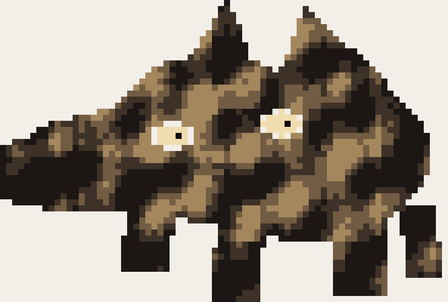

# Kumir Dissertation

Учебный проект на КуМире: пиксельная свинья по референсу.

Проект показывает, как простую картинку можно представить в виде матрицы и превратить ее в программу для исполнителя Робот.

## Результат



Исходный референс лежит в `reference/boar_reference.jpg`.

## Структура

```text
data/boar_matrix.txt       матрица пикселей
kumir/boar_robot.kum       готовая программа для КуМира
preview/boar_pixel.png     эталонный результат
preview/boar_pixel.svg     векторная версия эталона
reference/boar_reference.jpg
tools/build.py             сборка файлов из матрицы
```

## Как запустить

1. Открой `kumir/boar_robot.kum` в КуМире.
2. Выбери исполнителя Робот.
3. Создай поле не меньше `74 x 50`.
4. Поставь Робота в левую верхнюю клетку.
5. Запусти алгоритм `основная`.

## Как пересобрать

```bash
python tools/build.py
```

Скрипт заново создаст файл КуМира и эталоны из `data/boar_matrix.txt`.
